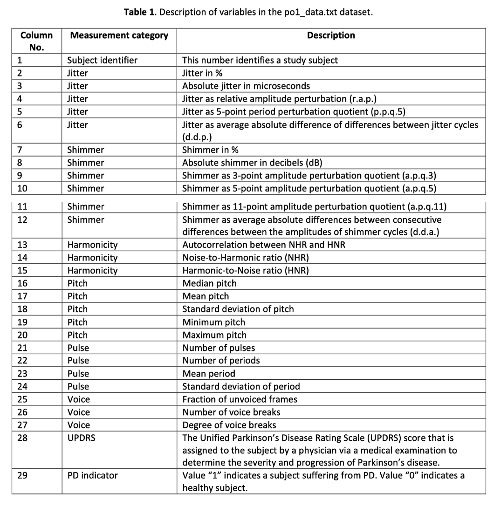
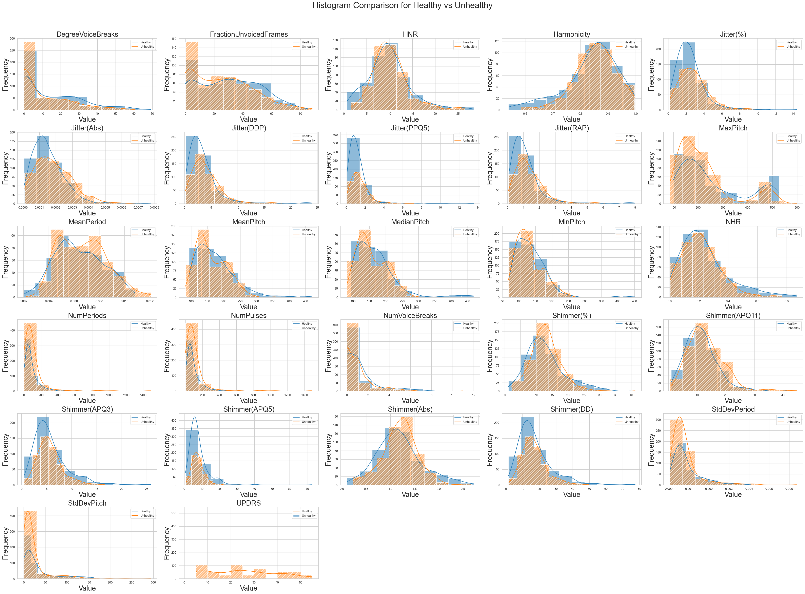
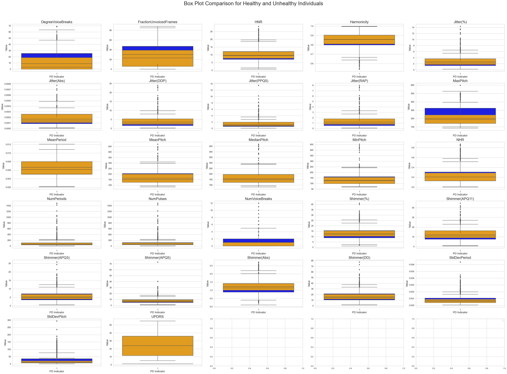

# Diagnosing Parkinson's Disease using Voice Sample Data Analysis

## Project Overview

Parkinson's Disease (PD) stands as a formidable challenge in the realm of neurological disorders. A progressive movement disorder affecting the nervous system, PD manifests through debilitating symptoms such as tremors, rigidity, bradykinesia, and postural instability[^1^]. While notable figures like Muhammad Ali, Michael J. Fox, and Pope John Paul II have grappled with PD, there remains no known cure for this affliction[^2^].

Diagnosing PD presents intricate challenges due to the lack of specific diagnostic tests and the invasive nature of some existing procedures. Blood tests, laboratory assessments, and brain scans are used to exclude other potential disorders, but these approaches often involve rigorous processes that can add to the distress of those affected by PD[^1^].

This project embarks on an exploration of a non-invasive diagnostic avenue using voice sample data analysis. The aspiration is to harness distinctive features in the acoustic properties of individuals' voices to discern between those affected by PD and those who are not. By probing these acoustic markers, the project aims to contribute to the development of an accessible and reliable diagnostic tool for PD.

## Project Objective

This project focuses on leveraging voice sample data analysis as a potential non-invasive method for diagnosing PD. The goal is to identify specific acoustic markers within voice samples that can distinguish between individuals with PD and those without the condition. By analyzing a set of acoustic features extracted from voice recordings, the project aims to contribute to the development of an accessible and reliable diagnostic tool for PD.

## Dataset and Methodology

The project utilizes the `po1_data.txt` dataset, comprising voice samples collected from both PD patients and healthy individuals. Each participant recorded 26 voice samples, encompassing sustained vowels, numbers, words, and sentences. Acoustic features extracted using Praat, a free acoustic analysis software[^3^], provide the foundation for subsequent analyses.

## Key Steps and Insights

The project unfolds through a series of steps:
### 1. Data Loading and Preprocessing

The dataset was loaded and preprocessed to prepare it for analysis. It consists of 1039 entries and 29 columns, each representing different acoustic features extracted from voice recordings. The data underwent the following steps:

#### 1.1 Data Dimensions

The dataset has a shape of (1039, 29), indicating 1039 instances and 29 features.

#### 1.2 Data Information

The information about the dataset was obtained using the `.info()` method. It confirmed that the dataset contains no missing values, and all columns have either `float64` or `int64` data types.

#### 1.3 Duplicate Rows

Duplicate rows were checked using the `.duplicated()` method. No duplicate rows were found in the dataset.

#### 1.4 Column Renaming

To improve clarity, the column names were updated with more meaningful labels. The new column names provide insights into the acoustic attributes they represent.

#### 1.5 Data Division

The dataset was divided into two subsets based on the "PD Indicator" column:

- `df1`: Voice samples from individuals without PD (Healthy). It contains 520 instances and 29 features.
- `df2`: Voice samples from individuals with PD (Affected). It contains 519 instances and 29 features.

These subsets will be used for comparative analysis and visualization to explore differences between healthy and PD-affected individuals.

### 2. Descriptive Analysis
In this section, we conducted a descriptive analysis of two sub-datasets representing individuals without Parkinson's disease (PD) and those with PD.
#### 2.1 Central Tendency 
Our objective was to elucidate disparities in central tendencies and variability between the two groups. We initiated the analysis by calculating summary statistics using the .describe() function for both datasets, excluding irrelevant columns like 'subject_id'. Since there are 29 columns we may not be able to capture all the key details. To get a better glimpse, subsequently, we computed the differences in key statistics, focusing on mean, median, and standard deviation, to reveal insights into the impact of PD on these attributes. 

| Feature                 | Mean Difference | Median Difference | StdDev Difference |
|-------------------------|-----------------|-------------------|------------------|
| MaxPitch                | -33.810474      | -14.8815          | -21.029639       |
| UPDRS                   | 24.003854       | 23.0000           | 14.752265        |
| NumPeriods              | 13.980606       | 6.5000            | 65.491394        |
| NumPulses               | 12.222718       | 5.0000            | 64.193786        |
| MeanPitch               | -11.558032      | -12.0885          | -13.053128       |
| MedianPitch             | -9.447163       | -9.5840           | -16.707123       |
| StdDevPitch             | -8.851501       | -4.1670           | -4.050640        |
| MinPitch                | -5.580112       | -4.4405           | -7.840752        |
| FractionUnvoicedFrames  | -5.068937       | -6.9150           | -0.342389        |
| DegreeVoiceBreaks       | -3.803388       | -5.5395           | -2.463653        |

The project's feature selection reveals significant differences between Parkinson's disease present and absent datasets. The largest difference is in "MaxPitch," with a mean difference of 33.81 and significant deviations in median and standard deviation. The study also shows divergence in severity scores in "UPDRS," speech pattern attributes like "NumPeriods," and significant differences in mean and median in "MeanPitch," "MedianPitch," and "StdDevPitch." These findings provide insights into key differentiating features, guiding the selection of features for effective discrimination between Parkinson's disease cases and healthy subjects in the project.

#### 2.2 Histogram
Next, we generate side-by-side histograms to compare the distribution of numeric features between healthy and unhealthy individuals in two DataFrames (df1 for healthy and df2 for unhealthy displaying both distributions in different colours with hatch patterns. This visualization helps to easily observe differences in feature distributions between the two groups. Make sure to have the required libraries installed and adjust the code to match your DataFrame structure and data.

The histograms unveil the distribution characteristics of diverse features within the dataset. For instance, the attributes related to jitter measurements, such as 'Jitter(%)', 'Jitter(Abs)', and 'Jitter(RAP)', display positively skewed distributions suggesting longer tails toward higher values. The 'Shimmer' features, which gauge voice variability, exhibit varying degrees of spread and skewness, notably 'Shimmer(APQ5)'. 'Harmonicity' maintains a mean of around 0.85 and a standard deviation of 0.09, reflecting its relatively consistent distribution. 'NHR' (noise-to-harmonics ratio) possesses a positively skewed distribution indicating data skewness towards higher values. Features like 'NumPulses' and 'NumPeriods' are strongly positively skewed, indicative of potential outliers or variability. Meanwhile, attributes such as 'MeanPeriod' and 'StdDevPeriod' have distributions centred near zero, confirming their low variation. 'UPDRS', possibly denoting Parkinson's disease severity, demonstrates a right-skewed distribution.

#### 2.3 Box-Plot

The analysis of voice recording features has revealed outliers across various parameters, such as pitch variations, vocal intensity shifts, harmonics-to-noise ratios, and temporal patterns. These outliers hold potential significance, indicating instances of unusual pitch modulation, abrupt changes in vocal intensity, deviations in harmonics, or variations in speech pace. Their interpretation is context-dependent and necessitates domain expertise for a comprehensive understanding of their implications, whether they signify unique vocal events, data collection errors, or valuable insights. Careful consideration should be given to the decision to handle these outliers, as they offer valuable cues about the underlying vocal characteristics and behaviours within the recordings.

### 3. Inferential Statistical Analysis
#### 3.1 Mean Differences and Confidence Intervals
For a t-test, we have used a 95% confidence level. This means that there is a 95% chance that the true difference in means is within the confidence interval.
| Feature | Mean Difference | Confidence Interval |
|---|---|---|
| MaxPitch | -33.810 | (-44.17996795243055, -23.4409801756263) |
| UPDRS | 24.004 | (23.105359296668126, 24.902347832426287) |
| NumPeriods | 13.981 | (1.114176699358996, 26.847035691333172) |
| MeanPitch | -11.558 | (-16.35437150895066, -6.761692949327117) |
| MedianPitch | -9.447 | (-14.256260205293817, -4.6380662879624275) |
| StdDevPitch | -8.852 | (-11.987994936130853, -5.715006667544863) |
| MinPitch | -5.580 | (-9.627504098689435, -1.5327197578393372) |
| FractionUnvoicedFrames | -5.069 | (-6.861681929109734, -3.27619271888196) |
| DegreeVoiceBreaks | -3.803 | (-5.099021178822456, -2.5077541139002353) |
| Shimmer(APQ11) | 1.772 | (1.2592897573566089, 2.2846059705982564) |

In this study, the mean difference for the MaxPitch feature is -33.810, which means that the mean MaxPitch value for the Parkinson's disease group is 33.810 Hz lower than the mean MaxPitch value for the control group. The confidence interval for this difference is (-44.17996795243055, -23.4409801756263), which means that we can be 95% confident that the true difference in mean MaxPitch values is between -44.17996795243055 Hz and -23.4409801756263 Hz.

#### 3.2 Hypothesis Testing
In the conducted hypothesis testing analysis, we explored the differences in various acoustic features, pitch-related measures, and clinical scores between healthy and unhealthy individuals. The findings provided compelling evidence of significant distinctions between the two groups across multiple dimensions.

Fail to reject H₀:
|      Feature      | Z-Score | Critical Z-Value |      Result      |
|-------------------|---------|------------------|------------------|
|        HNR        |  1.298  |      2.576       | Fail to reject H₀|
|     MinPitch      | -1.913  |      2.576       | Fail to reject H₀|
|        NHR        | -2.436  |      2.576       | Fail to reject H₀|
|    NumPeriods     |  1.508  |      2.576       | Fail to reject H₀|
|     NumPulses     |  1.312  |      2.576       | Fail to reject H₀|
| NumVoiceBreaks    | -2.559  |      2.576       | Fail to reject H₀|
|    Shimmer(%)     |  0.318  |      2.576       | Fail to reject H₀|
| Shimmer(APQ3)     | -0.573  |      2.576       | Fail to reject H₀|
| Shimmer(APQ5)     | -0.707  |      2.576       | Fail to reject H₀|
|  Shimmer(Abs)     |  0.908  |      2.576       | Fail to reject H₀|
|   Shimmer(DD)     | -0.573  |      2.576       | Fail to reject H₀|
|  StdDevPeriod     | -1.879  |      2.576       | Fail to reject H₀|

Features where the Null Hypothesis (H₀) is Not Rejected: In contrast, certain features did not surpass the critical z-values, indicating that there was insufficient evidence to claim significant differences between healthy and unhealthy individuals for these specific aspects. These results suggest that, at the given significance level, these features did not exhibit substantial disparities. While the differences were not statistically significant, these features still contribute to a holistic understanding of the comparison between the two groups.

Reject H₀:
|            Feature           | Z-Score | Critical Z-Value |   Result    |
|-------------------------------|---------|------------------|-------------|
|     DegreeVoiceBreaks         |  -4.073 |        2.576     | Reject H₀  |
| FractionUnvoicedFrames        |  -3.923 |        2.576     | Reject H₀  |
|        Harmonicity            |   2.601 |        2.576     | Reject H₀  |
|          Jitter(%)            |   3.180 |        2.576     | Reject H₀  |
|        Jitter(Abs)            |   5.482 |        2.576     | Reject H₀  |
|        Jitter(DDP)            |   3.615 |        2.576     | Reject H₀  |
|       Jitter(PPQ5)            |   3.613 |        2.576     | Reject H₀  |
|        Jitter(RAP)            |   3.615 |        2.576     | Reject H₀  |
|           MaxPitch            |  -4.524 |        2.576     | Reject H₀  |
|         MeanPeriod            |   2.651 |        2.576     | Reject H₀  |
|          MeanPitch            |  -3.344 |        2.576     | Reject H₀  |
|        MedianPitch            |  -2.726 |        2.576     | Reject H₀  |
|     Shimmer(APQ11)            |   4.796 |        2.576     | Reject H₀  |
|        StdDevPitch            |  -3.916 |        2.576     | Reject H₀  |
|              UPDRS            |  37.069 |        2.576     | Reject H₀  |

Features where the Null Hypothesis (H₀) is Rejected: These features exhibited z-scores that surpassed the critical z-values, indicating substantial differences between healthy and unhealthy individuals. For instance, "DegreeVoiceBreaks" displayed a z-score of -4.073, well beyond the critical value of 2.576, leading to the rejection of the null hypothesis. Similarly, "FractionUnvoicedFrames" showcased a z-score of -3.923, confirming a notable distinction between the groups. Furthermore, features like "Harmonicity" presented a z-score of 2.601, reinforcing the rejection of the null hypothesis and emphasizing the divergence between the two groups. Additional measures, including various "Jitter" metrics, "MaxPitch," "MeanPeriod," "MeanPitch," "MedianPitch," "Shimmer(APQ11)," "StdDevPitch," and "UPDRS" scores, all exhibited z-scores that significantly exceeded the critical values, reinforcing the significance of these differences.

3. **Visual Comparison**: Visualizations, including side-by-side histograms and box plots, allow for intuitive comparisons of feature distributions between the two groups.

5. **Hypothesis Testing**: Z-scores were leveraged for hypothesis testing to ascertain the statistical significance of mean differences.

6. **Visualizing Confidence Intervals**: The visualization of confidence intervals elucidated the practical implications of calculated mean differences.

## Implications and Future Directions

The project's analyses and visualizations unveiled notable discrepancies in acoustic features between healthy individuals and those with PD. These findings hold promise for the advancement of a non-invasive diagnostic instrument for PD, potentially enabling timelier interventions and improved patient outcomes.

Future research avenues could involve larger datasets, integration of machine learning techniques for predictive modeling, and clinical validation to assess the reliability of identified acoustic markers.

## Conclusion

In the medical landscape, this project showcases the potency of data-driven insights by harnessing voice sample data to diagnose PD. Through rigorous statistical analyses and insightful visualizations, key acoustic features were illuminated, contributing to the quest for an accurate, non-invasive, and accessible diagnostic tool for Parkinson's Disease.

## References

[^1^]: National Institute of Neurological Disorders and Stroke. (2023). Parkinson's Disease Information Page. [https://www.ninds.nih.gov/healthinformation/disorders/parkinsons-disease](https://www.ninds.nih.gov/healthinformation/disorders/parkinsons-disease)
[^2^]: Parkinson's Foundation. (2023). Notable Figures. [https://www.parkinson.org/understanding-parkinsons/statistics/notable-figures](https://www.parkinson.org/understanding-parkinsons/statistics/notable-figures)
[^3^]: Sakar, B.E. et al. (2013). [https://ieeexplore.ieee.org/abstract/document/6451090](https://ieeexplore.ieee.org/abstract/document/6451090) and [https://www.fon.hum.uva.nl/praat/](https://www.fon.hum.uva.nl/praat/)
